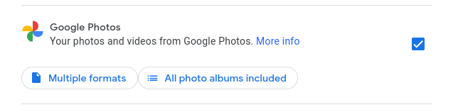
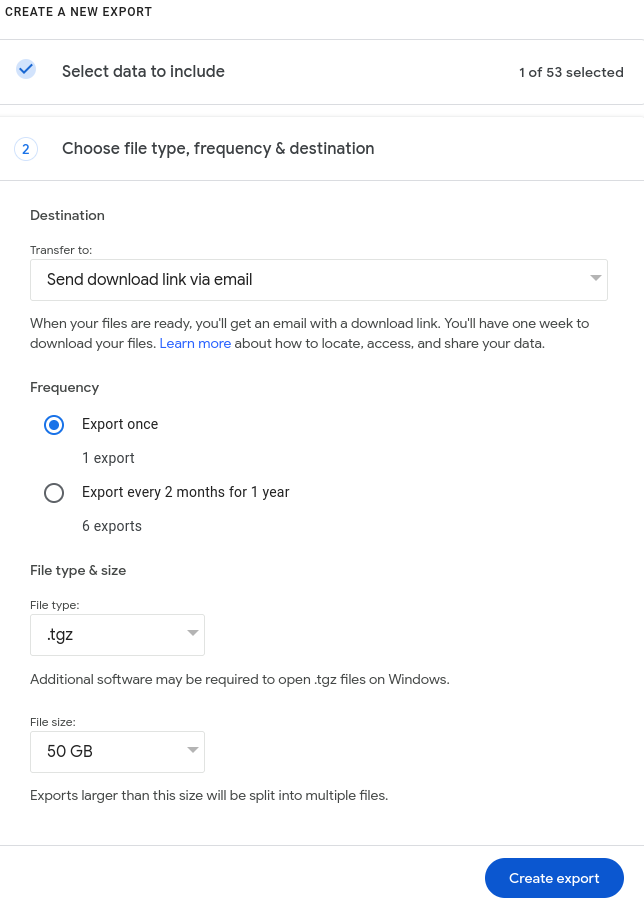

# Leaving Google Photos for Immich
This guide will document how to export a Google Photos library using Google
Takeout & self-host an instance of [immich](https://immich.app).

## Google Takeout
- Sign in to [Google Takeout](https://takeout.google.com).
- Select to export your photos from Google Photos, optionally choosing which
  albums to export:
  
- Choose the export format of your data.Export via many differing proprietary,
  web-based systems can be chosen, but for our purposes, choose
  `Send download link via email`.
- For frequency, choose `Export once`.
- For file type, you can choose either .zip or .tgz.
- For file size you can choose 2GB to 50GB chunks.
  
This operation can take several hours or days. Although Takeout states it will
notify you when the operation is finished, it does not always do so. It is
common that the operation will fail & you will have to do it over again.
If this is the case, try slightly different options, such as selecting .zip
instead of .tgz or a different file size.

## Set-up Immich
Immich recommends using
[docker compose for installation](https://immich.app/docs/install/docker-compose).
A more streamlined version can be seen [here]().

## Explain dir structure
Further explain how the postgres server keeps the dir structure

## Immich-go

## etc
